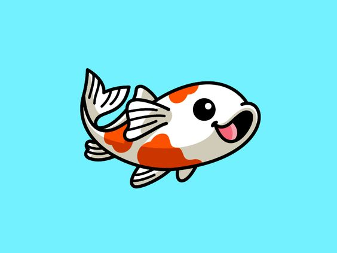

<p align="center">

</p>

> Skill

<code></code>
&emsp;
<code></code>
&emsp;
<code></code>
&emsp;
<code></code>
&emsp;
<code></code>
&emsp;
<code></code>
&emsp;
<code></code>
&emsp;
<code></code>
&emsp;
<code></code>

```rust
fn hello() -> String {"Hello World!".to_string()}
```
